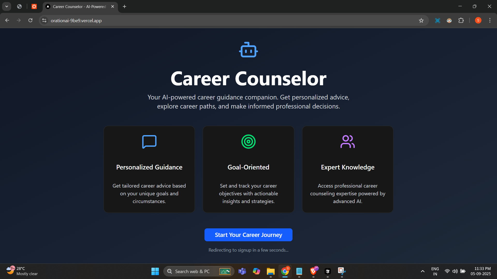
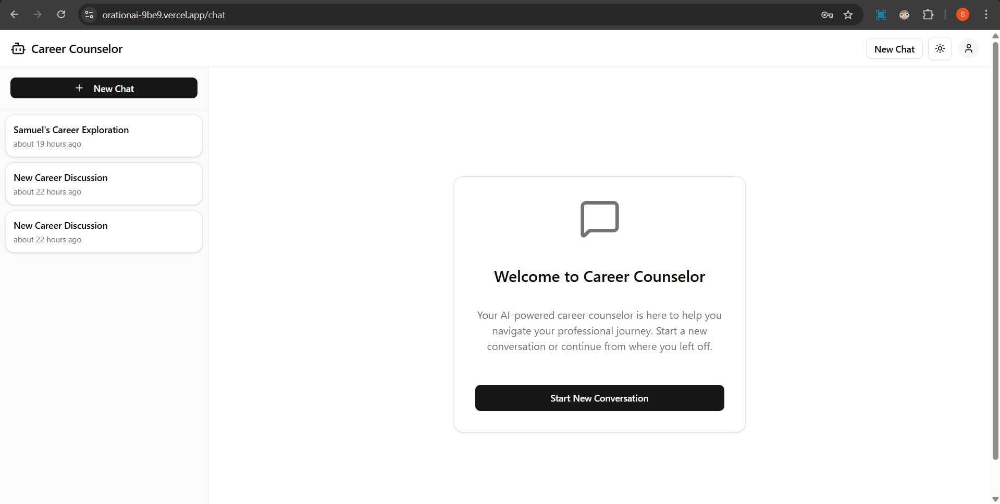
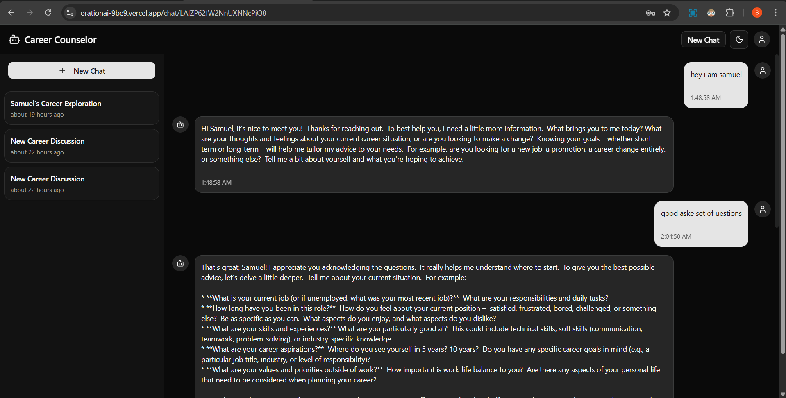
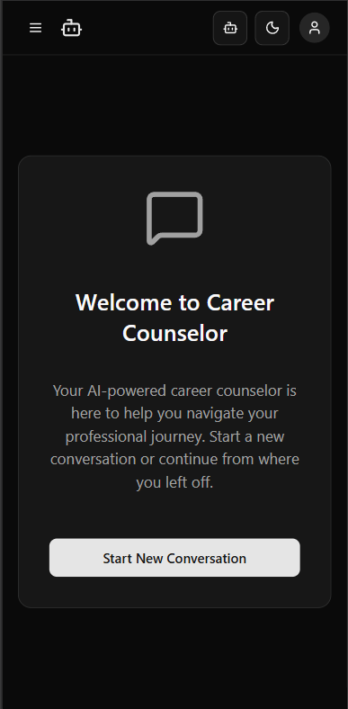
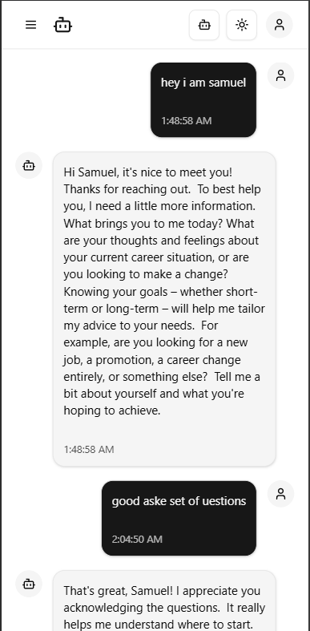

This is a Career Counselor AI Chat app where you can login and ask more about your aspiring career goals 

## Deployed On Vercel
**Live demo:** [https://orationai-9be9.vercel.app/](https://orationai-9be9.vercel.app/)







## For testing or using it
Sign in with email samuelmasih.sls777@gmail.com and put any password to enter and you will be able to chat as Samuel Masih 

## Features

**Authentication**: Very Basic 
**AI Career Counselor Chat Interface**: Gives meaning full career advices and guidance, implemented using gemini models
**Message Persistence**: Manages Session for chats and saves messages in DB with proper information
**Chat History**: Maintained Chat history user can continue from where they left off the chat , Proper title and edit title or delete chat is also provided to user
**Extra Features**: Theme Toggle, Responsive for both mobile and PC, indicators for messages when the chat bot generates the output.

## Tech Stack 
Next.js, typescript, tRPC, TanStack, PostgreSQL, Drizzle, Gemini Models

## Project Setup

clone the repository

#RUN
npm intall

Set Up Environment Variables

then run development server:

```bash
npm run dev
# or
yarn dev
# or
pnpm dev
# or
bun dev
```

Open [http://localhost:3000](http://localhost:3000) with your browser to see the result.

## By - Samuel Masih